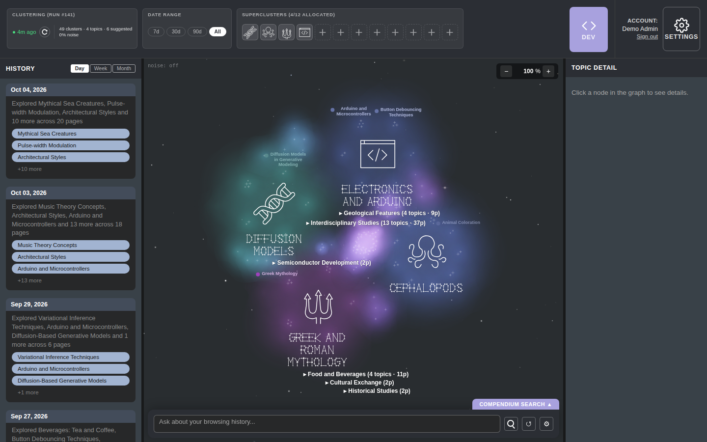
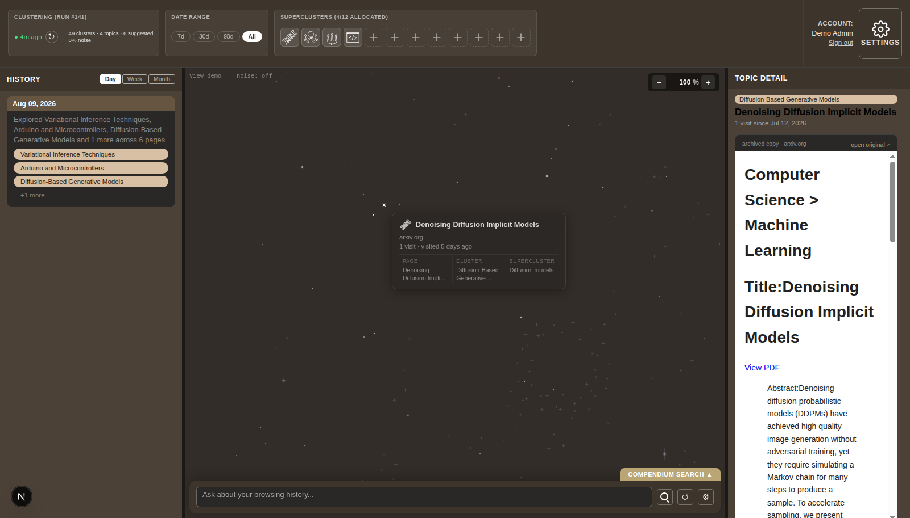
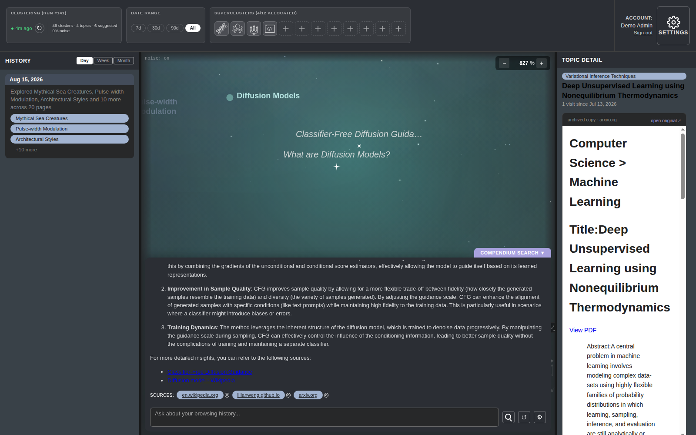

# Compendium


This project aims to turn curiosity-driven browsing into a topic-based
knowledge compendium. Every page browsed gets filtered through a skip gate
and then clustered into topics, laid out as an explorable constellation
graph, and made queryable through a RAG chat agent that cites its sources
back onto the graph. On top of the automatically-clustered layer, users can
manually select "superclusters" (clusters of clusters) representing topics
they are interested in to highlight in the graph.



## Quickstart

Requires **Node 22+**. To set up, copy-paste the below:

```bash
git clone https://github.com/skaniti/compendium.git
cd compendium
npm ci
npm run demo
```

A hosted instance runs at https://compendium.skaniti.dev; it is read-only for visitors.
Sign in with the demo account: email `demo@traversal.local`, password `youniverse`
(the hosted instance's own demo account; the Docker quickstart below bootstraps a
separate demo login with its default password).

`npm run demo` boots a dependency-free stub backend (`apps/web/demo/server.mjs`)
serving a curated demo compendium from static fixtures, plus the Next.js
dev server pointed at it. The demo drops the user straight into the
populated app: graph, diary, topic detail, and chat are live from the first
paint, under a single local identity with full control over the synthetic
data. Demo mode exists to explore the app before committing to personal
use; building a compendium from real browsing requires the backend and
collectors.

## Demo notes

**Data:** The demo compendium is curated from real, publicly licensed web
pages (Wikipedia, arXiv, GitHub, Stack Exchange, and a few others) spanning
four topics — diffusion models, Greek/Roman mythology, electronics/Arduino,
and cephalopods — respread across a plausible browsing timeline that stays
"recent" no matter when the repo is cloned. Full source list and licensing
notes: `apps/web/demo/fixtures/ATTRIBUTION.md`. The seed also carries a small
synthetic archived/skipped population (temporary; see
`apps/api/data/demo-seed/README.md`) so the Pipeline dev view has data, and
`apps/web/demo/fixtures/pipeline/` is recorded from it.

**Chat:** 12 question/answer runs from the live agent are recorded in
`apps/web/demo/fixtures/chat/index.json`. The search bar at the bottom of the graph
replays them token-by-token over SSE, complete with source pills that frame
the cited nodes back on the graph. Anything else typed in falls back to a
response that explains demo mode and suggests a question from the list.

**Mutations:** Topic edits, exclusions, and preference writes persist for
the life of the stub process and reset on restart. Clicking `Recluster`
waits a couple of seconds and bumps the run number but does not actually
recluster the data in demo mode.





## Full-stack quickstart (Docker)

The Quickstart above (`npm run demo`) is frontend-only, zero-cost, and
already populated. This is the other path: the real stack — Postgres +
the FastAPI backend (`apps/api`) + this frontend — via Docker Compose.

```bash
git clone https://github.com/skaniti/compendium.git
cd compendium
docker compose up --build
```

Postgres starts, `apps/api` waits for it, runs its migration chain, and
bootstraps two logins, then `apps/web` builds and starts pointed at it.
First run downloads and builds the backend's Python dependencies (a few
minutes); after that, `docker compose up` is fast. Once `api` reports
healthy (`docker compose ps` in a second terminal shows it — or just retry
the URL; it loads once ready), open **http://localhost:3000** and log in as
the demo account:

- **Email:** `demo@traversal.local`
- **Password:** `demo`

(Both are `apps/api/backend/scripts/bootstrap_user.py`'s own intentionally-public
local-dev defaults, not secrets. A primary/admin account is also created
from `BOOTSTRAP_EMAIL`/`BOOTSTRAP_PASSWORD` — override either pair, or set
`BOOTSTRAP_DEMO_EMAIL`/`BOOTSTRAP_DEMO_PASSWORD`, via a `.env` file next to
`docker-compose.yml`.)

**What you actually get:** a working login against a real backend, with a
**populated** compendium — graph, diary, and topic detail all have real
data from the first `docker compose up`, no LLM API keys or capture-pipeline
run required. `SEED_DEMO=1` (the default) bootstraps the demo login and then
loads a reviewed, portable export of the same 158-page corpus documented in
`apps/web/demo/fixtures/ATTRIBUTION.md` — already processed (summaries,
chunk/page/clustering embeddings, clusters, superclusters) — into it. See
`apps/api/data/demo-seed/README.md` for exactly what's in the seed and its
provenance. The loader is idempotent (a second `up` logs "already seeded"
and leaves the data alone).

Two things stay honest gaps:

- **Chat needs your own key.** Every other surface reads from the database,
  but the chat agent calls out to an LLM live — set `OPENAI_API_KEY` (a
  sibling `.env` file next to `docker-compose.yml`, or export it before
  `docker compose up`) to use it. Without a key, chat responds in-band with
  "OpenAI API key not configured." (streamed as a normal chat answer,
  zero cost/sources) — the rest of the app is unaffected.
- **Page-preview images 404.** The route that serves them exists; the
  seed's `captured_assets` rows (image metadata) ship, but the underlying
  binary files don't — see `apps/api/data/demo-seed/README.md` for the
  detail.

Want to rebuild the corpus yourself from scratch instead of using the
shipped seed (e.g. to add new pages, or verify the pipeline end-to-end)?
`apps/api/scripts/demo/ingest_demo_v1.py` runs the original 59-URL v1
subset through the live capture pipeline by hand (fetch, LLM skip-gate,
LLM summarization, embedding, clustering) — real `OPENAI_API_KEY` /
`ANTHROPIC_API_KEY` spend, and it needs the private predecessor repo
reachable through the gitignored `docs/project-plans` symlink at this
repo's root (see the comment above `V1_DOC_PATH` in the script) — not part
of the compose stack.

Ports: web on `:3000`, API on `:8001` (`:8001/docs` for the OpenAPI UI,
`:8001/health` for a liveness check). Postgres is not published to the
host — only reachable from `api` inside the compose network. Stop with
`docker compose down`; add `-v` to also drop the Postgres volume.

## Tests

```bash
npm test
```

Runs the Vitest suite (component tests + the stub server's own smoke tests)
headlessly via jsdom.

## Architecture

- **Frontend:** Next.js (App Router), at `apps/web` — the UI seen above:
  graph canvas, diary/history panel, topic detail, header widgets, and the
  chat search bar. The repo is an npm-workspaces monorepo; root `npm`
  commands (`dev`, `build`, `test`, `lint`, `demo`) delegate into this
  workspace, so the Quickstart above works unchanged from the repo root.
- **Typeface:** `apps/web/fonts/almagest` — Almagest, an original caps-only
  constellation face (every glyph is an asterism) in three optical tiers,
  compiled by `npm run fonts:build` into `apps/web/public/fonts/almagest/`
  and used for supercluster names on the graph.
- **API proxy:** `apps/web/app/api/[...path]/route.ts` forwards every
  `/api/*` call verbatim to whatever `BACKEND_URL` points at (injecting the
  auth cookie, streaming SSE through unbuffered), so the frontend never
  talks to a backend host directly. `apps/web/app/captured-assets/[...path]/route.ts`
  is the same proxy for `/captured-assets/*` (page preview
  images/stylesheets), which the backend serves outside the `/api` prefix.
- **Demo backend:** `apps/web/demo/server.mjs`, a dependency-free Node HTTP
  server that answers the same endpoint contract from static fixtures under
  `apps/web/demo/fixtures/`. `npm run demo` (`apps/web/demo/launcher.mjs`)
  boots it and points `BACKEND_URL` at it automatically.
- **Real backend:** `apps/api`, a FastAPI service extracted born-clean from
  the predecessor project (see "Full-stack quickstart (Docker)" above).
  `BACKEND_URL` is the entire contract between this frontend and whatever
  serves it — the Next dev server, `npm run demo`'s stub, or `apps/api`
  itself all satisfy the same contract.
- **Browser extension:** `apps/extension`, a Manifest V3 collector that
  passively tracks browsing and POSTs captures to `apps/api`. No build step
  — load it unpacked (`chrome://extensions` → "Load unpacked", or Firefox's
  equivalent) pointed at the `apps/extension` directory.
- **Android collector:** `apps/android`, a GeckoView-based browser that
  captures sessions and POSTs them to `apps/api`, same as the extension.
  Builds via the Gradle wrapper (`./gradlew assembleRelease`, producing an
  unsigned APK); release signing happens out-of-band — no keystore or
  signing config is committed.
- **Dev views:** they live at `/dev/<view>` behind the header's Dev toggle;
  the first ported view is Pipeline, backed by `/api/pipeline/*` and
  `/api/analytics/archive-health`.

## Status

This repo is the successor to an earlier Dash + FastAPI prototype, ported
surface by surface. Ported and live here: the app shell, the diary/history
and topic-detail panels, the header widgets, the constellation graph (a
vendored D3 port with supercluster nameplate layout, an original typeface,
and a tunable layout), the streaming chat with source pills, the
auth/session/role mechanics, and the Pipeline dev view (`/dev/pipeline`). The FastAPI backend lives at `apps/api` and
runs the hosted instance; the browser extension (`apps/extension`) and the
Android collector (`apps/android`) ship from here too.

Migration in progress: the internal dev/observability views (data
browser, prompts, logs, traces, overview, clusters, dqBot), a deploy target for this
frontend, and retirement of the predecessor's Dash surface.

## Known limitations

The settled graph layout is sensitive to noise proportion: showing or
hiding noise re-runs the full force simulation, and different node counts
can settle into visibly different arrangements. Removing that sensitivity
is tracked as follow-up work. The graph's debug overlay (the noise toggle
and the admin-only view-demo/return-to-admin controls) is gated to
admin-context sessions — an admin, or an admin viewing as demo — and
hidden for every other role, matching Dash's own admin-context gate. The
demo-account and view-as machinery is different: it exists for the hosted
deployment and is off by default, gated behind `DEMO_ROLE_TOOLING` (stub)
and `NEXT_PUBLIC_DEMO_ROLE_TOOLING` (frontend). The `/login` page belongs
to that machinery; the default demo flow never needs it. `scripts/dev.sh`
sets both flags for development with the role machinery enabled.

## Conventions

- **Commit format:** `docs/references/COMMIT-FORMAT.md` — parens-free
  `type: subject`, lowercase, no AI attribution, enforced by a husky
  `commit-msg` hook.
- **Pushes are gated:** the `pre-push` hook refuses to push unless
  `ALLOW_PUSH=1` is set.
- **Line endings:** LF repo-wide, enforced via `.gitattributes`.
- **Contributing:** `CONTRIBUTING.md`; conduct in `CODE_OF_CONDUCT.md`;
  vulnerability reports per `SECURITY.md`.

## License

MIT — see `LICENSE`.
